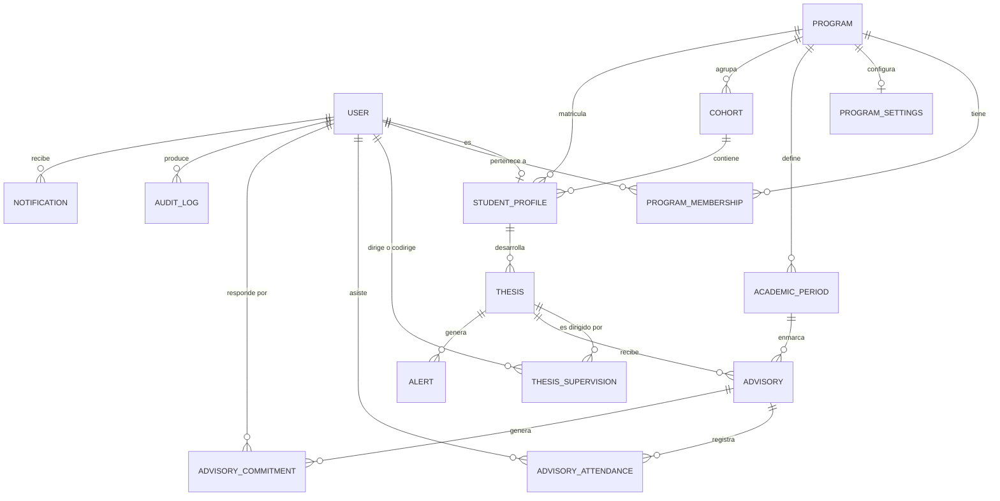

# Modelo de datos

Fuente de verdad: [`prisma/schema.prisma`](../prisma/schema.prisma).
Todas las tablas usan identificadores `cuid()`.

## Diagrama

## Entidades

| Entidad | Tabla | Para qué |
|---|---|---|
| `User` | `users` | Cuentas. Email único, `passwordHash`, rol, bandera `active` (baja lógica), `mustChangePassword` para las contraseñas temporales y `sessionsRevokedAt` para cerrar sesiones abiertas. |
| `Program` | `programs` | Programa académico con su nivel (`MASTER`, `UNDERGRADUATE`…). |
| `ProgramMembership` | `program_memberships` | Vincula coordinadores y docentes con sus programas. |
| `AcademicPeriod` | `academic_periods` | Periodo con fechas, `advisoryDeadline` y estado. |
| `Cohort` | `cohorts` | Cohorte de ingreso (`2025-1`, `2026-1`…). |
| `StudentProfile` | `student_profiles` | Datos académicos del estudiante: código, semestre, cohorte. |
| `Thesis` | `theses` | Trabajo de grado: título, estado y fecha de asignación. |
| `ThesisSupervision` | `thesis_supervisions` | Histórico de direcciones y codirecciones. |
| `Advisory` | `advisories` | Asesoría: fecha programada, fecha real, estado, tema, resumen. |
| `AdvisoryAttendance` | `advisory_attendances` | Asistencia de cada participante a la sesión. |
| `AdvisoryCommitment` | `advisory_commitments` | Compromisos derivados de la asesoría. |
| `Alert` | `alerts` | Alertas detectadas, con su severidad, su ciclo de vida y la gestión humana registrada (`managedAt`, `managedById`, `managementNote`). |
| `ProgramSettings` | `program_settings` | Umbrales y mínimo de asesorías del programa. |
| `AuditLog` | `audit_logs` | Traza inmutable de las acciones relevantes. |
| `Notification` | `notifications` | Notificaciones internas por usuario. |

## Decisiones de diseño

### La supervisión es una tabla, no dos columnas

Guardar `directorId` y `codirectorId` dentro de `Thesis` impediría saber quién
dirigió antes. `ThesisSupervision` conserva `startedAt`, `endedAt`, `active` y
`assignedById`: al cambiar de director se cierra la fila anterior y se crea otra,
todo en la misma transacción y con su registro de auditoría.

### Reglas de negocio aplicadas en la base

Prisma no expresa índices únicos parciales, así que la migración inicial los
agrega en SQL. No dependen de que la capa de servicio se comporte bien:

| Índice | Regla |
|---|---|
| `thesis_supervisions_one_active_director` | Un solo director activo por trabajo |
| `thesis_supervisions_one_active_codirector` | Un solo codirector activo por trabajo |
| `theses_one_active_per_student` | Un solo trabajo activo por estudiante |
| `academic_periods_one_active_per_program` | Un solo periodo activo por programa |
| `alerts_one_active_per_thesis_type` | Una sola alerta activa por trabajo y tipo |

### La asesoría conoce su periodo

`Advisory.periodId` es una llave foránea real, no un dato derivado de la fecha:
el periodo al que pertenece una sesión es un hecho académico y hace que contar
el cumplimiento sea una consulta directa. El periodo se resuelve al crear la
asesoría, tomando el que contiene la fecha o, si ninguno la contiene, el activo.

### Fechas

Las fechas académicas (asesorías, periodos, vencimientos) son `@db.Date`: días
de calendario, sin hora ni zona. Las marcas de tiempo del sistema
(`createdAt`, `confirmedAt`, `assignedAt`) sí son `DateTime` completos.

### El programa de un estudiante vive en su perfil

`ProgramMembership` vincula a **coordinación y docentes** con los programas que
atienden. Un estudiante no necesita membresía: su programa es un dato de
`StudentProfile`. Cualquier consulta que pregunte "quién pertenece a este
programa" tiene que mirar las dos cosas.

### Nada se borra

No hay borrado físico de asesorías realizadas, asignaciones históricas, alertas
ni auditoría. Los usuarios se desactivan con `active = false`; las alertas pasan
a `RESOLVED` o `DISMISSED`; las asignaciones se cierran con `endedAt`.

## Índices adicionales

Además de las llaves y los únicos parciales, hay índices en `users.email`,
`users(role, active)`, `theses(programId, status)`, `theses(studentId)`,
`thesis_supervisions(thesisId, active)`, `thesis_supervisions(userId, active)`,
`advisories(thesisId, status)`, `advisories(periodId, status)`,
`advisories(scheduledDate)`, `alerts(thesisId, status)` y
`audit_logs(entityType, entityId)`.

Las consultas del dashboard cargan trabajos y contexto en dos consultas con
`include`, evitando el patrón N+1 al calcular el estado de cada trabajo.
