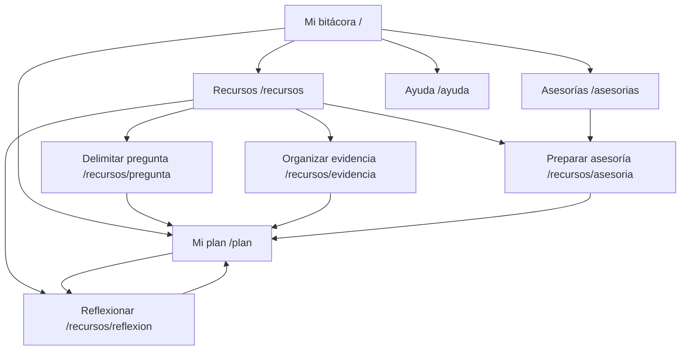

# Diseño y evidencias de la semana 03

## Alcance entregado

Se inició un frontend en Nuxt 4.5.2, Vue 3 y TypeScript en `../gradtrack-nuxt`. Es un prototipo funcional del espacio del estudiante con ejemplos de asesorías y un plan personal persistido en el navegador. No sustituye la aplicación Next.js, no comparte sesión y no consulta PostgreSQL. La guía solicita iniciar el frontend; una migración integral sigue siendo una decisión de alcance.

## Metáfora pedagógica y principios

La bitácora de investigación organiza el recorrido en planificar, investigar, conversar y reflexionar. El estudiante puede fijar un compromiso, anotar una duda y revisar su siguiente acción. El cumplimiento no se presenta como calificación ni como evidencia automática de dominio.

Se aplican las reglas descritas por la guía: regreso en las páginas interiores; cancelar borradores; deshacer el último cambio local; confirmar el borrado; ayudas próximas a los campos; identidad visual compartida; y navegación visible. Las zonas principales agrupan cinco opciones de menú, tres accesos del inicio, cuatro recursos y tres campos de edición. Esto responde al criterio de la actividad, sin afirmar que 7±2 sea una ley universal de diseño.

No se consultó la carpeta institucional `lib ing sw/`. Las atribuciones a capítulos concretos de Pressman, Sommerville y MODESEC deben contrastarse con esas ediciones antes del artículo final. La fundamentación bibliográfica complementaria está en `SEMANA_03_BIBLIOGRAFIA.md`.

## Mapa formal de navegación

El menú compartido permite ir directamente a cualquiera de las cinco secciones desde cualquier página. Cada guía tiene regreso al catálogo. Contando activaciones de enlaces, el máximo desde el inicio hasta una guía es dos, tanto en escritorio como en móvil. No se cuenta el desplazamiento vertical como clic. Si se añade contenido, debe repetirse la prueba de profundidad.

## Mockups interactivos y figura GUI

Las pantallas implementadas funcionan como prototipo de alta fidelidad. Las capturas están en `../gradtrack-nuxt/evidencias/`: inicio, plan y catálogo de recursos en 1440 px y 390 px. La figura compuesta `figura-gui.png` reúne las tres vistas de escritorio con rótulos (a), (b) y (c).

Pie sugerido: **Figura 1. Interfaces del prototipo educativo GradTrack: (a) bitácora de inicio; (b) planificación de compromisos; (c) recursos para la investigación. Datos de demostración.**

### Texto base para la sección GUI del artículo

El diseño del prototipo se organizó mediante la metáfora de una bitácora de investigación, con actividades de planificación y reflexión. Se implementaron páginas y componentes reutilizables en Nuxt y Vue 3, con TypeScript. Según los criterios establecidos en la guía de la semana 03, se incluyeron navegación visible, regreso, cancelación y reversión de cambios locales. La Figura 1 muestra el punto de entrada, el espacio de planificación y el catálogo de recursos. Los compromisos se almacenan localmente y las asesorías son ejemplos; la integración con los registros institucionales corresponde a una fase posterior.

La evaluación técnica comprobó el acceso a nueve rutas, cuatro recorridos de dos interacciones hasta recursos formativos y las acciones de persistencia, cancelación y reversión en dos tamaños de pantalla. Estas verificaciones no constituyen un estudio de eficacia educativa ni una evaluación de usabilidad con estudiantes.

## Verificación ejecutada

- Compilación de producción Nuxt: correcta.
- Comprobación de tipos Nuxt: correcta.
- Navegación en Edge automatizado: nueve rutas por tamaño, 1440×1050 y 390×844.
- Cuatro recursos accesibles en dos activaciones por tamaño.
- Crear compromiso y recuperarlo tras recarga; completar y deshacer; cancelar borrador; cancelar y confirmar borrado; deshacer borrado: correcto.
- Recurso inexistente: respuesta 404.
- Desbordamiento horizontal: no detectado en las rutas y tamaños probados.
- Errores JavaScript inesperados: ninguno en esos recorridos.
- Evidencia reproducible: `../gradtrack-nuxt/scripts/verify.mjs` y `../gradtrack-nuxt/evidencias/resultados.json`. El script usa Playwright del proyecto original y Edge instalado, con contextos nuevos y sin acceder a PostgreSQL.
- Proyecto original: TypeScript pasó después de asociar títulos de diálogos, ayudas y errores de formulario y restaurar el atributo `required`. ESLint no pudo ejecutarse por la dependencia ausente `eslint-plugin-react-hooks`; no se declara aprobado.

Se utilizó Playwright en Edge, no Google Antigravity ni su Browser Subagent. Si el docente exige evidencia de esas herramientas específicas, debe completarse ese paso en su entorno. No se ha realizado una auditoría WCAG completa ni pruebas con lectores de pantalla.

## Protocolo de prueba con estudiantes

Invitar participantes del público objetivo, explicar el tratamiento de las respuestas y usar datos ficticios. Proponer cuatro tareas: encontrar una guía, registrar un compromiso, cancelar un borrador y recuperar un cambio con deshacer. Registrar éxito, tiempo, errores, intervenciones y comentarios sin dirigir las respuestas. Aplicar un instrumento de usabilidad adecuado después de las tareas, documentar la versión y el procedimiento de puntuación, y analizar las limitaciones de la muestra. No completar resultados ni puntajes antes de recoger datos.

## Pendientes externos

- Decidir si el objetivo posterior es integrar este frontend con GradTrack o migrar toda la aplicación.
- Verificar la cobertura de indexación de la selección 5/5/5 mediante acceso institucional.
- Contrastar los capítulos de los libros y el texto MODESEC con los originales.
- Acreditar el flujo en Antigravity si su uso es obligatorio.
- Ejecutar la evaluación con estudiantes y registrar resultados reales.
